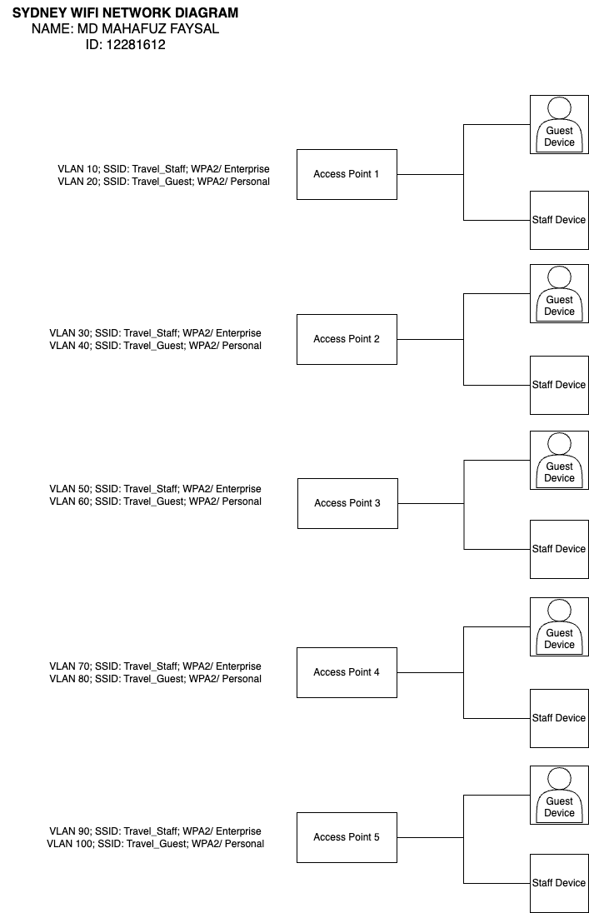

# Network Design
This section gives the detailed network design.

[Assumptions](#1-assumptions)  
[Network Design Diagrams and Justifications](#2-network-design-diagrams-and-justifications)  
[WiFi Design](#wifi-design)  
[Address Allocations](#3-address-allocations)  
[Recommended Hardware](#4-recommended-hardware) | [Plan](./plan.md) | [Cloud Services](./cloud.md) | [Security](./security.md) | [Ethics](./ethics.md) | [Reflection](./reflection.md) | [Return to index](./README.md)

## 1. Assumptions
- Location (city) of the headquarters: Sydney 2000, NSW
- Locations (cities) of the branches (must be at least 3):
  - Melbourne 3000, VIC
  - Brisbane 4000, QLD
  - Perth 6000, WA
- Number of staff in headquarters at Sydney, NSW: 65 employees
- Number of staff in one branch office at Brisbane, QLD: 20 employees

## 2. Network Design Diagrams and Justifications 
### 2.1 Network Diagram for the Headquarters at Melbourne:
#### 2.1.1 Descriptions
- Number of staff in headquarters at Sydney 2000, NSW: 65 employees
- Main Router (Internet Connection) → Firewall → Core Switch → Branching out to:
  - Switch 1 (connects 30 PCs)
  - Switch 2 (connects 35 PCs)
  - Access Point (WiFi) serving mobile devices, laptops
  - Internal Servers: DHCP, File Server, Mail

#### 2.1.2 Wired Network
Wired Network diagram as an "image.png" and original ".drawio" file.
- Image:
 

- Draw.io:
  

#### 2.1.3 WiFi Network
**WiFi Design**:
- Table of Specification of Headquarter:
    | Specification | Sydney                |
    |:--------------|:---------------------:|
    | SSID          | Sydney_WIFI           |
    | Security      | WPA2-Enterprise       |
    | Password      | Sydney_2025@          |
    | Frequency     | 2.4GHz & 5GHz         |
    | Channel       | 11                    |
    | Other         |                       |

WiFI Network diagram as an "image.png" and original ".drawio" file.
- Image:
 

- Draw.io:
  

### 2.2 Network diagram for the branch office at Brisbane:
#### 2.2.1 Description
- Number of staff in one branch office at Brisbane 4000, QLD: 20 employees
- Branch Router → Small Firewall → Switch → Branching out to:
  - 20 PCs (wired connection)
  - 1 Access Point (WiFi for mobile devices, laptops)
  - Site-to-site VPN connection to Head Office

#### 2.2.2 Wired Network
Wired Network diagram as an "image.png" and original ".drawio" file.
- Image:
 

- Draw.io:
  

#### 2.2.3 WiFi Network
**WiFi Design**:
- Table of Specification of Branch:
    | Specification | Brisbane              |
    |:--------------|:---------------------:|
    | SSID          | Brisbane_WIFI         |
    | Security      | WPA2-Enterprise       |
    | Password      | Brisbane_2025@        |
    | Frequency     | 2.4GHz & 5GHz         |
    | Channel       | 6                     |
    | Other         |                       |

WiFI Network diagram as an "image.png" and original ".drawio" file.
- Image:
 

- Draw.io:
  

**Design explanation**
- Router + Firewall for network security.
- WiFi Access Point uses 802.11ac standard to ensure high speed for wireless devices.
- Network division between headquarters and branches according to client-server model, can be centrally managed from headquarters.

### 2.3 Explanation of key design decisions
The travel agency organization operates with two offices: Headquarters in Sydney and a Branch Office in Brisbane. 
Each location features a network design tailored to its specific size and requirements. Firewalls are deployed at both sites to safeguard sensitive data.

#### 2.3.1 Head Office (Sydney)

- **Scale:** Approximately 60 employees (Based on the number of PCs shown in the diagram)

- **Network Design:** Three-layer network model comprising Firewall, Core Switch, and Access Switches
    - **Rationale:** This design ensures future scalability and optimal operational efficiency, clearly segmenting the functions of each device layer
    - **Equipment:**
        - **Main Router:** Provides Internet connectivity for the entire office (Gateway: `33.0.0.1`, Subnet: `33.0.0.0/24`)
        - **Firewall:** (IP: `33.0.0.2`) Deployed between the Main Router and the Core Switch to protect the entire internal network system from external threats
        - **Core Switch:** (IP: `33.0.0.3`) 1x core switching device . Responsible for handling high-speed traffic, directly connecting to the Firewall, critical servers, and Access Switches
        - **Access Switches:** 5x access layer switches   
            - Switch 1 (IP: `33.0.0.10`): Management/HR/Admin  
            - Switch 2 (IP: `33.0.0.11`): Finance  
            - Switch 3 (IP: `33.0.0.12`): Marketing  
            - Switch 4 (IP: `33.0.0.13`): Customer Support   
            - Switch 5 (IP: `33.0.0.14`): IT Dept  
        - **Servers:** Servers (DHCP, CRM, Mail, Web, CCTV) are connected directly to the "Core Switch" to ensure optimal performance and accessibility  
        - **Access Points (APs):** 5x APs (IPs: `33.0.0.33` to `33.0.0.37`) are connected to their respective Access Switches to provide wireless network connectivity
 
- **WiFi Design:**  
  - **Access Points (APs):** 5x APs (IPs: `33.0.0.33` to `33.0.0.37`)
  - **SSIDs**:  
    - "Travel_Staff" (VLAN 10,30,50,70,90; SSID: Travel_Staff; WPA2/ Enterprise): for staffs  
    - "Travel_Guest" (VLAN 20,40,60,80,100; SSID: Travel_Guest; WPA2/ Personal): for guests  

#### 2.3.2 Branch Office (Brisbane)  
- **Scale:** Approximately 20 PCs/Users (Based on the device count in the diagram).
- **Network Design:** Simplified network design, primarily two-layered (Edge/Security and Access). Includes direct Internet connection, Firewall, and a central Switch.
    - **Rationale:** Cost-effective and simple to manage for a smaller branch office footprint.
    - **Equipment:**
        - **Branch Office Router:** Provides primary Internet connectivity for the branch (Gateway: `12.0.0.1`, Subnet: `12.0.0.0/24`). Connects to the Firewall.
        - **Firewall:** (IP: `12.0.0.2`) 1x Firewall device positioned between the Router and the Switch. Responsible for security policy enforcement and traffic filtering. May act as the termination point for the VPN.
        - **Switch:** (IP: `12.0.0.3`) 1x central Switch. Connects all local end devices including PCs and Access Points.
        - **Access Points (APs):** Provides wireless network access.
            - Access Point 1 (Staff) (IP: `12.0.0.4`)
            - Access Point 2 (Guest) (IP: `12.0.0.5`)
        - **End Devices:** Connects approximately 20 PCs (IP Range: `12.0.0.10` - `12.0.0.29`).
    - **Connectivity:** Utilizes an IPSec VPN tunnel over the Internet for secure communication with the Head Office.

  - **WiFi Design:**  
    - Access Points (APs): 2x APs  
    - SSIDs:  
      - "Travel_Staff" (VLAN 10,30; SSID: Travel_Brisbane_Staff; WPA2/ Enterprise): For staff  
      - "Travel_Guest" (VLAN 20,40; SSID: Travel_Brisbane_Guest; WPA2/ Personal): For guests  

#### 2.3.3. Overall Summary
- Design Rationale: The choice of network model (3-layers at Head Office, 2-layers at Branch Office) is based on current employee size and future expansion needs, balancing performance, security, and cost.  
- Firewalls: Established in both offices to protect the organization's sensitive data (employee and customer information, internal systems like web, HR, accounting, CRM).  
- WiFi: at both locations, configured with multiple SSIDs (Staff and Guest) isolated by VLANs. Staff WiFi uses WPA2 security (with 802.1X added at Headquarters).
- Using VLANs to logically separate different departments (e.g., HR, IT, Finance) even though they share the same physical switch. This improves security and performance, and helps contain broadcast traffic.

## 3. Address Allocations
To manage IP addresses efficiently, **private IP addressing** is used with subnetting tailored to each site:
Head Office (65 employees):

IP Range / IP Subnet: 33.0.0.0/24
Gateway IP: 33.0.0.1
DHCP IP Range: 33.0.0.10 – 33.0.0.100
Static IP (Servers): 33.0.0.2, 33.0.0.3,... (etc.)

### 3.1 Address Allocation - Headquarters Sydney

| Device             | Function/Department           | Address                     |
|:-------------------|:-----------------------------:|:---------------------------:|
| Main Router        | Internet Connection           | 33.0.0.1       			  |
| Firewall           | Network Security              | 33.0.0.2       			  |
| Core Switch        | Core Switching                | 33.0.0.3       			  |
| DHCP Server        | Dynamic IP Allocation         | 33.0.0.4       			  |
| CRM Server         | Customer Relationship Mgmt    | 33.0.0.5       			  |
| Mail Server        | Email Server                  | 33.0.0.6       			  |
| Web Server         | Web Server                    | 33.0.0.7       			  |
| CCTV Server        | Surveillance Camera Server    | 33.0.0.8   	  			  |
| Switch 1           | Management/HR/Admin           | 33.0.0.10      			  |
| Switch 2           | Finance           		         | 33.0.0.11      			  |
| Switch 3           | Marketing                     | 33.0.0.12      			  |
| Switch 4           | Customer Support  		         | 33.0.0.13      			  |
| Switch 5           | IT Dept  					           | 33.0.0.14      			  |
| AP1                | Wireless Access            	 |  33.0.0.33                 |
| AP2                | Wireless Access            	 |  33.0.0.34                 |
| AP3                | Wireless Access            	 |  33.0.0.35                 |
| AP4                | Wireless Access            	 |  33.0.0.36                 |
| AP5                | Wireless Access            	 |  33.0.0.37                 |
| PCs (via Switch 1) | Management/HR/Admin PCs       |  33.0.0.20  -  33.0.0.32   |
| PCs (via Switch 2) | Finance PCs                	 |  33.0.0.40  -  33.0.0.49   |
| PCs (via Switch 3) | Marketing PCs              	 |  33.0.0.50  -  33.0.0.64   |
| PCs (via Switch 4) | Customer Support PCs       	 |  33.0.0.70  -  33.0.0.82   |
| PCs (via Switch 5) | IT Dept PCs                	 |  33.0.0.90  -  33.0.0.99   |

---

### 3.2 Address Allocation - Branch Office Brisbane

| Device               | Function/Department | Address       |
| :--------------------| :------------------ | :------------ |
| Branch Office Router | Gateway             | 12.0.0.1      |
| Firewall             | Security            | 12.0.0.2      |
| Switch               | Networking          | 12.0.0.3      |
| Access Point 1       | Staff Wireless      | 12.0.0.4      |
| Access Point 2       | Guest Wireless      | 12.0.0.5      |
| x20 PCs              | Staff Workstations  | 12.0.0.10 - 12.0.0.29 |

---

All IP addresses are statically assigned for critical devices, while DHCP is used for end-user devices. The address plan supports scalability, network segmentation (using VLANs), and simplifies troubleshooting and administration.

## 4. Recommended Hardware. 
## 4.1 Head office - Sydney
### Main Rounter
- Device Name: Cisco Catalyst 8300 Series Edge Platforms
- Number: 1
- Price: ~$5,000
- Link: https://www.google.com/search?q=https://www.cisco.com/c/en/us/products/routers/catalyst-8300-series-edge-platforms/index.html

### Firewall
- Device Name: Palo Alto Networks PA-Series (PA-4000 Series)
- Number: 1
- Price: ~$10,000
- Link: https://www.paloaltonetworks.com/network-security/next-generation-firewall

### Core Switch  
- Device Name: Cisco Catalyst 9300 Series Switches
- Number: 1
- Price: ~$4,000
- Link: https://www.cisco.com/c/en/us/products/switches/catalyst-9300-series-switches/index.html

### Subordinate Switch (Switch 1 - 5)
- Device Name: Cisco Catalyst 9200 Series Switches
- Number: 5
- Price: ~$1,000
- Link (Cisco Catalyst 9200): https://www.cisco.com/c/en/us/products/switches/catalyst-9200-series-switches/index.html

### Access Point (AP1 - AP5)
- Device Name: Cisco Catalyst 9100 Series Access Points
- Number: 5
- Price: ~$500
- Link (Cisco Catalyst 9100): https://www.google.com/search?q=https://www.cisco.com/c/en/us/products/wireless/catalyst-9100-access-points/index.html

## 4.2 Branch office - Brisbane
### Branch Office Router
- Device Name: Cisco ISR 4331 Integrated Services Router
- Number: 1
- Price:  ~$1,500
- Link: https://www.google.com/search?q=https://www.cisco.com/c/en/us/products/routers/isr-4000-series/models/isr-4331-integrated-services-router.html

### Firewall
- Device Name: Fortinet FortiGate 60F
- Number: 1
- Price: ~$800
- Link: https://www.google.com/search?q=https://www.fortinet.com/products/next-generation-firewall/entry-level/fortigate-60f

### Switch 
- Device Name: Cisco Catalyst 2960-L Series Switch 
- Number: 1
- Price (24 gates): ~$500 USD
- Link (24 gates): https://www.google.com/search?q=https://www.cisco.com/c/en/us/products/switches/catalyst-2960-l-series-switches/models/catalyst-2960-l-24ts-ll.html

### Access Point 1 (Staff)
- Device Name: Ubiquiti UniFi AP AC Lite
- Number: 2 APs
- Price: $100
- Link: https://www.google.com/search?q=https://ui.com/wi-fi/unifi-ac-lite

### Access Point 2 (Guest)
- Device Name: Ubiquiti UniFi AP AC Lite
- Number: 1 AP each eara
- Price: ~$100
- Link: https://www.google.com/search?q=https://ui.com/wi-fi/unifi-ac-lite
