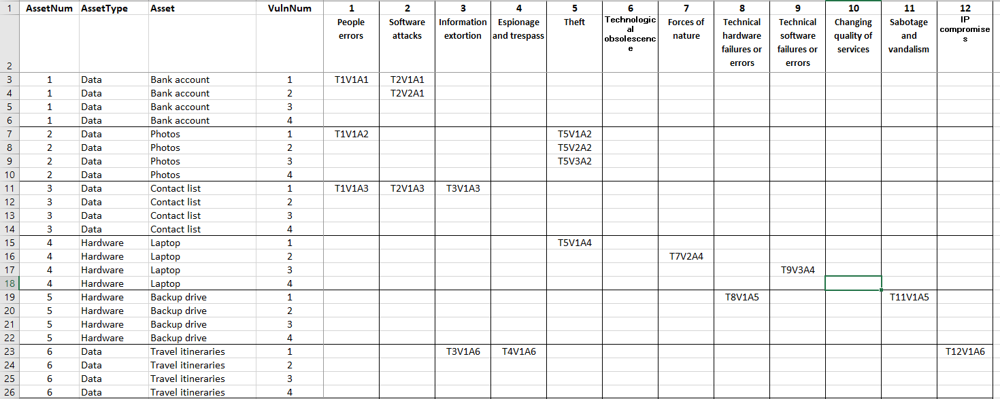
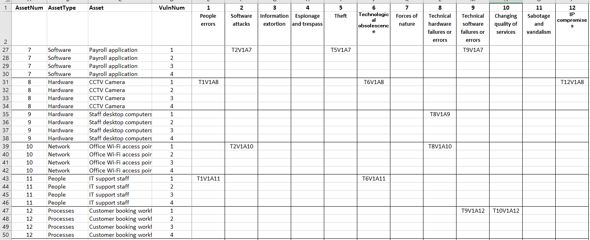

# Security
This section gives a cyber security risk assessment for the company and recommended security controls.

[Risk Assesment](#risk-assessment)  
[Security Controls](#security-controls)  
[Plan](./plan.md)  [
Network Design](./network.md)  
[Cloud Services](./cloud.md)  
[Ethics](./ethics.md)  
[Reflection](./reflection.md)  
[Return to index](./README.md)  

## 1. Risk Assessment
Henry

- Complete the risk assessment spreadsheet and consider vulnerabilities across at least 8 of the 12 information security threats.

[View risk assessment spreadsheet](./risk-assessment.xlsx)

### Introduction

This section outlines the cybersecurity risk assessment conducted for the travel agency’s IT system. The assessment identifies key assets across hardware, software, data, network, people, and processes, and evaluates their exposure to various threats based on likelihood and impact. The outcomes support the implementation of appropriate security controls to mitigate risk and protect business continuity.

---

### Summary of Risk Assessment

A total of 12 assets are assessed, including critical data (e.g., contact lists, travel itineraries), hardware (e.g., laptops, backup drives), software applications (e.g., payroll), and people/process elements.

The risk analysis based on 12 threats outlined in the InfoSecThreats table, including:
- People errors (e.g., misconfiguration, accidental deletions)
- Software attacks (e.g., malware, phishing)
- Theft and ransomware
- Hardware/software failures
- IP compromises and sabotage

The risk matrix (TVAMatrix) links each threat to one or more assets, based on identified vulnerabilities. Risk was calculated using likelihood, impact and rank accordingly.

#### Contact List (Data Asset)
**Threats**: People Errors, Software Attacks  
**Vulnerabilities**:
- Employee mistakenly sends contact list to wrong client via email
- Malware captures and leaks Outlook contact list

---

#### *Photos (Data Asset)
**Threat**: People Errors  
**Vulnerability**:
- User accidentally deletes entire folder of photos

---

#### Laptop (Hardware Asset)
**Threat**: Theft  
**Vulnerability**:
- Laptop is lost or stolen with unencrypted data

---

#### Travel Itineraries (Data Asset)
**Threats**: Information Extortion, IP Compromises  
**Vulnerabilities**:
- Ransomware encrypts itinerary database
- Fake travel websites scrape itinerary details to resell to third parties

---

#### CCTV Camera (Hardware Asset)
**Threat**: People Errors  
**Vulnerability**:
- Admin uses default admin password never changed

These assets were selected as highest priority for mitigation based on their critical business value, sensitivity, and susceptibility to both internal and external threats. They represent the agency’s most sensitive customer and operational data, as well as essential infrastructure for trust and accountability.

In the next section, we recommend 03 security controls targeting the most impactful of these assets — focusing on Contact List protection as a representative example.

---

## 2. Security Controls
Md Mahafuz Faysal: handle this section

### TVAMatrix Screenshot

---

### Recommended Security Controls

To protect the **Contact List**, which has the highest cumulative risk, the following three security controls are recommended:

---

#### 1. **Multi-Factor Authentication (MFA)**

**Description:**  
Requires users to verify identity using at least two methods: password + OTP/token/email code.

**Application:**  
Enable MFA for all email systems (e.g., Microsoft 365, Outlook) to prevent unauthorized access to staff mailboxes where contact lists may reside.

**Benefit:**  
Reduces the effectiveness of phishing attacks and stolen credentials.

**Drawback:**  
May slightly slow down login process for users but significantly improves security.

---

#### 2. **Endpoint Encryption**

**Description:**  
Applies full-disk or folder-level encryption on staff laptops and devices that store sensitive contact lists.

**Application:**  
Use BitLocker (Windows) or FileVault (macOS) to encrypt laptops used by travel consultants.

**Benefit:**  
Prevents data leakage even if the device is stolen or lost.

**Drawback:**  
Requires IT staff to manage encryption keys and recovery procedures.

---

#### 3. **Access Control via Role-Based Permissions**

**Description:**  
Only authorized staff can view, edit, or export the contact list data.

**Application:**  
Implement group policies or access control lists (ACLs) so that only travel consultants and their manager can access client contact records.

**Benefit:**  
Minimizes insider threat and unintentional errors.

**Drawback:**  
Requires initial setup and ongoing access review by IT administrator.

---

### Conclusion

This risk assessment provides a comprehensive understanding of the travel agency's current vulnerabilities. By addressing the most critical asset—the contact list—with layered security controls, the company can greatly reduce the risk of data breaches, maintain customer trust, and ensure compliance with data protection regulations.
